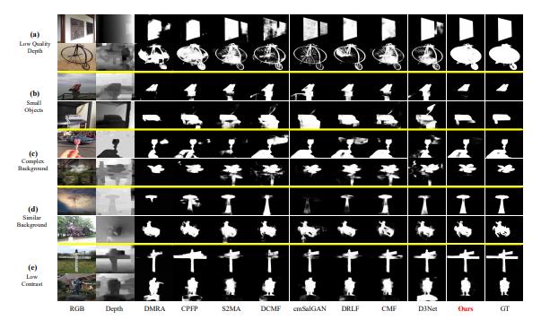

# Cross-modal Hierarchical Interaction Network for RGB-D Salient Object Detection
  
   Figure.1 The overall architecture of the proposed HINet model.  
   Published in Patern Recognition.
# 1.Requirements
Python v3.6, Pytorch 0.4.0+, Cuda 10.0, TensorboardX 2.0, opencv-python

# 2.Data Preparation
Download the test data from [here](https://pan.baidu.com/s/1SSxeqTsc1buN4JMglbJdaA)[code:NEPU], test_in_train data from [here](https://pan.baidu.com/s/15pUzASvTaBV9swHzpwBBhA 
)[code:NEPU]. Then put them under the following directory:  

    -Dataset\   
       -train\  
       -test\ 
           -NLPR\
           -STERE\
           -SSD\
           -LFSD\
           -NJUD\
       -test_in_train\
       
# 3.Training/Testing & Evaluating
* **Training the HINet**  

Please download the released code and then:  
  
    run python Train.py  

* **Testing the HINet**  

Please download the [model parameters]()[code:NEPU] and then:  

    run python Test.py  

Then the test maps will be saved to './Salmaps/'

* **Evaluate the result maps**  

You can evaluate the result maps using the tool from [here](https://pan.baidu.com/s/1gmckcn7FZuDP2ufiTM6qow)[code:NEPU], thanks for [Dengpin Fan](https://github.com/DengPingFan).

# 4.Results
* **Qualitative comparison**  

  
Figure.2 Qualitative comparison of our proposed method with some SOTA methods.  

* **Quantitative comparison** 

  
Table.1 Quantitative comparison with some SOTA models on five public RGB-D benchmark datasets. 

* **Salmaps**   
The salmaps of the above datasets can be download from [here](https://pan.baidu.com/s/1sswZiW-2lDaYPPnpK9Ahbw) [code:NEPU]

# 5.Citation 
Thank you for your interest in our work, please cite:

@article{BI2022109194,
title = {Cross-modal Hierarchical Interaction Network for RGB-D Salient Object Detection},
journal = {Pattern Recognition},
pages = {109194},
year = {2022},
issn = {0031-3203},
doi = {https://doi.org/10.1016/j.patcog.2022.109194},
url = {https://www.sciencedirect.com/science/article/pii/S0031320322006732},
} 

# 6.Contact  
If you have any questions, feel free to contact us via tianzhu.xiang19@gmail.com (T.-Z. Xiang) or wuranwan2020@sina.com (Ranwan Wu). 
For more related work, you can also visit [tianzhu.xiang](https://github.com/visionxiang)

